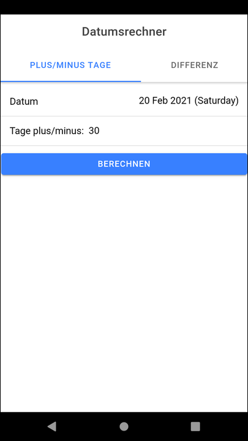
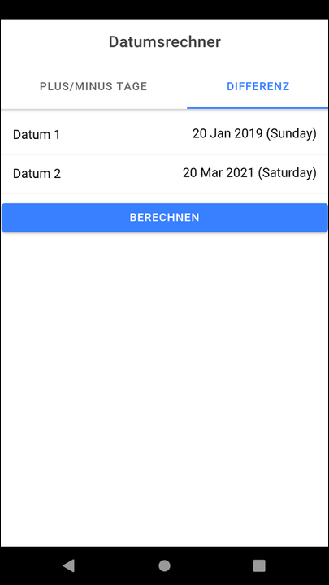

# Ionic-App "Datumberechnung" (Date Calculation) #

 

Simple [Ionic](https://ionicframework.com) app to perform date calculations:
* Number of days between two days.
* Add/subtracting number of days from given date.

 

----

## Screenshots ##

 

 &nbsp; 

 

----

## License ##

 

See the [LICENSE file](LICENSE.md) for license rights and limitations (BSD 3-Clause License)
for the files in this repository.

 
